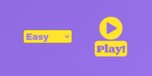
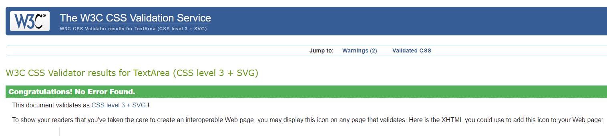
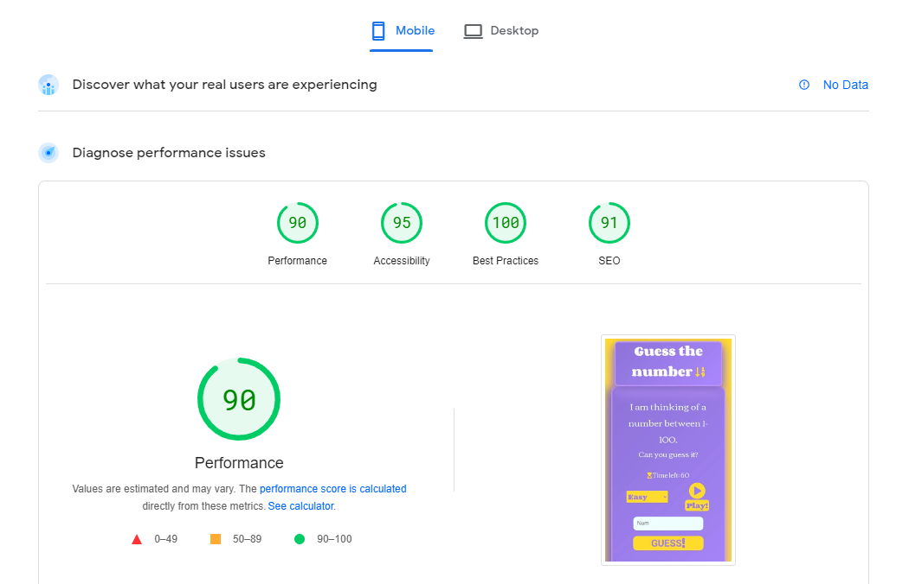

# Guess The Number

My project is a guess the number game. The user guesses between 1 and 100, then a message will appear to let them know if it was too high or too low. There is a timer with 60 seconds on the clock, but you can change the difficulty from Easy to Medium or Hard and the clock will run down faster depending on which one the user chooses.

[Live website](https://philiposull.github.io/Project-Two/)

## Features

### Existing Features

#### The heading and logo

- At the very top of the page is the main heading and logo, big and easy for the user to see. Straight away when the user enters the website they will know what type of game it is from reading it.

#### Question area

- This section lets the user know the number is between 1 and 100. If they try guess any higher or lower than that they will be met with an alert.

#### Difficulty and Play Button

- This section has a difficulty dropdown menu going from Easy to Medium to Hard, on Easy the timer is 60 seconds, then it gets quicker and quicker going from Medium to Hard, giving the user a more difficult time to guess the right number.

#### Guess Area

- In this section the user plays the game, they make their guesses and click the guess button or the Enter key.

#### Timer and hourglass

- The timer starts at 60 seconds when played on Easy, then the 60 seconds speed up depending on whether the game is played on Medium or Hard. This section also has an hourglass and the hourglass is made up of 3 icons overall, the first hourglass is full at 60 seconds, at 30 seconds it then changes to a half hourglass and at 0 it changes to an empty hourlgass.

#### High/Low and Guesses

- In this section on the first line of text it lets the user know to press the play button to start the game, if they press the guess button first nothing will happen. The first line of text also changes when the user starts playing, it lets them know if their guess was too high or too low. If they win it congratulates them, if they lose it tells them times up and lets them know what the answer was. The second line of text is the numbers of guesses the user has used up trying to guess. In the third line of text it lets the user know the numbers they have already guessed.

#### New Game

- This section gives the user the opportunity to start a new game if the previous one has ended in a win or loss, or if they are in the middle of a game and might like to restart.

### Features left to implement
---
- I would add Keyframes Animation
  - I would have the Game Area dropdown menu & play button to slide in from the left and the timer to slide in from the right.
- I would add a score board between the user and the computer for multiple rounds of play.

### Going forward:
- For my projects going forward I would commit more, sometimes I can spend hours trying to solve issues one after another without a commit. 

## Wireframes

- This was built using [Balsamiq](https://balsamiq.com/wireframes/)

## Technologies

### Languages

1. HTML
2. CSS
3. JavaScript

### Frameworks & Tools

- Git
- Github
- Gitpod
- Google Fonts
- W3schools
- Stackoverflow
- Remove.bg
- CSS Gradient
- Font Awesome
- Neumorphism

## Testing

### Validator Testing
---

### HTML
  - The W3C Markup Validation Service was used and passed with no errors.

### CSS
  - The W3C Jigsaw CSS Validation Service was used and passed with no errors.

### JavaScript
  - No errors were found when passing through the official [Jshint Validator](https://jshint.com/) 
    - The following metrics were returned:
    - There are 5 functions in this file.
    - Function with the largest signature take 1 arguments, while the median is 1.
    - Largest function has 38 statements in it, while the median is 10.
    - The most complex function has a cyclomatic complexity value of 12 while the median is 2.

### Functionality
---

| **Feature** | **Action** | **Expected Outcome** | **Actual Outcome** |
|-------------|------------|---------------------|-------------------|
| Dropdown menu | Press dropdown arrow | List of difficulties from Easy to Hard appear | PASS |
| Dropdown menu | Select Easy, Medium or Hard | When the game starts, it starts with the selected difficulty | PASS |
| Dropdown menu | Start the game | Once the game starts the dropdown menu is disabled until the game restarts | PASS |
| Guess Area | Put it in a number that isn't between 1 and 100 | Alert saying to choose a number between 1 and 100 | PASS |
| Guess Button | Make a guess and press the button | It registers your guess | PASS |
| Guess Button | Make a guess and press the Enter button | It registers your guess | PASS |
| Hourglass | Let the timer run down | Hourglass changes from full to half to empty depending on the time left | PASS |
| Press Play text | Make a guess | The text changes to let the user know if their guess was too high or too low | PASS |
| Press Play text | Let the timer run down | The text changes to time's up and gives the user the answer | PASS |
| No. of Guesses text | Make multiple guesses | The text lets you know how many guesses you have made | PASS |
| Guessed Numbers | Make multiple guesses | The text lets you know which numbers you have guessed | PASS |
| New Game | Press the New Game button | The game starts over again if it has ended, or restarts if it was in the middle of a game | PASS |

## Performance

### Desktop

- [PageSpeed Insights](https://pagespeed.web.dev/) was used to test the performance of the website for Desktop

### Mobile

- [PageSpeed Insights](https://pagespeed.web.dev/) was used to test the performance of the website for Mobile.

### Compatibility with browsers

The website was tested on these broswers:

- Google Chrome
- Brave
- Microsoft Edge
- Mozilla Firefox

### Performing tests on devices

The project website was tested on these devices:

- Acer TravelMate | P
- Samsung S10+

### Performing tests on different screen-sizes

The project website was tested on numerous screen-sizes:

- From 280px to 5000px

## Deployment

The website development was created in the "main" branch. This branch was deployed using GitHub Pages.

- This site was deployed by completing the following steps:

1. Open GitHub.
2. Click on the project to be deployed.
3. Navigate to the "Settings".
4. Navigate down to the "GitHub Pages".
5. Click on "Check it out here!".
6. Select the "main" branch and select "Save".
7. The link to the live website was ready on the top.

## Cloning

- Clone a project following the steps:

1. Open GitHub.
2. Click on the project to be cloned.
3. You will be provided with three options to choose from, HTTPS, SSH or GitHub CLI, click the clipboard icon in order to copy the URL.
4. Open a new terminal.
5. Change the current working directory to the location that you want the cloned directory.
6. Type 'git clone' and paste the URL copied in step 3.
7. Press 'Enter' and the project is cloned.

## Forking

- Fork a project following the steps:

1. Open GitHub.
2. Click on the project to be forked.
3. Click on Fork button in the upper right hand corner.
4. Clone the fork of your repo, so you can edit the contents locally.
5. Make edits to your local cloned copy of the repo on your computer.
6. `git` `add`, `commit` and `push` those edits back to your fork on GitHub.
7. Suggest the changes that you made, to be added to Project repo using a pull request.

## Credits

### Content

  - All the text was written by me.
  - The idea of the game was taken from searching [Google](https://www.google.com/)
  - I found Ania Kubów on [YouTube](https://www.youtube.com/channel/UC5DNytAJ6_FISueUfzZCVsw)
    - I used the same timer she used in her Whac-a-mole game.
  - The icons on the whole page were taken from [Font Awesome](https://fontawesome.com/v5/search)
  - The background shadowing was taken from [Neumorphism](https://neumorphism.io/#e0e0e0)
  - The CSS linear gradient was taken from [CSS Gradient](https://cssgradient.io/gradient-backgrounds/)
  - The Corben and Roboto fonts were taken from [Google Fonts](https://fonts.google.com/)

## Acknowledgements

I would like to take the opportunity to thank:

- My mentor Brian Macharia

- A passed student Feddie Dermesonoglou

- To all the lovely people from Code Institute and on Slack 

